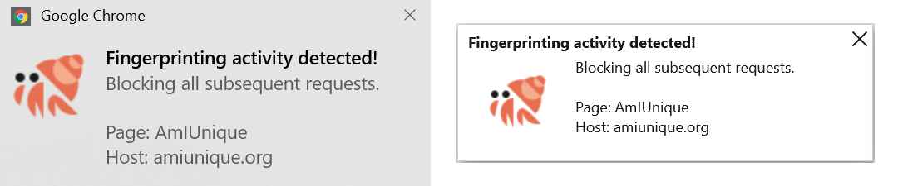

---

title: Catch websites red-handed taking fingerprint of your browser

---

It is hard, if not impossible, to both prevent fingerprinting and still provide customized environment for the user. Hence, we want to identify fingerprinting attempts by counting the number of different APIs employed by a page, especially APIs that are not frequently used for benign purposes. In this blog, we will introduce you a brand new tool called *FingerPrint Detector (FPD)* that we have implemented as a part of our *JShelter* extension. This tool allows users to gain more control over browser fingerprinting that have became an invisible threat for our privacy.

## Introduction to browser fingerprinting

As you are reading this article, you may be already familiar with a phenomenon called [*browser fingerprinting*](https://arxiv.org/pdf/1905.01051.pdf). But if you have never heard about it, you can easily deduce its meaning from the name. In short, browser fingerprinting is a stateless tracking method vastly prevalent on the internet in recent years. As a word "fingerprint" suggests, it contains a combination of features which make (*almost*) every fingerprint unique and identifiable, similar to a human fingerprint. 

These features consist of obtainable data from wide variety of sources but mostly accessible through browser's application interfaces aka *API*s. Although APIs provide essential functionality for modern websites, they may leak sensitive information about your browser, operating system or even device itself. As there are many different devices connected to the internet and each of them is using very specific configuration, leaking hardware and software properties may result in sufficiently identifiable fingerprint of your browser. Furthermore, do not forget about possibility of leaking information that may uncover liable vulnerabilities of your system for the sake of potential attackers.

At first glance, browser fingerprinting seems to be the great evil in the world full of privacy concerns. Well, appearances can be deceptive, and we should know about two distinct ways of using browser fingerprinting. Firstly, there is *a negative or destructive usecase*, where websites are gathering browser fingerprints without user consent. This procedure allows websites and third parties to share fingerprint as browser/device identifier to track users across different domains or sessions. Secondly, there is *a positive or constructive usecase*, where websites tend to collect information about your system to improve usability or security of their application. For example, based on your system properties, applications can recommend you to install critical security updates. Some websites collect browser fingerprints to verify known devices of their users to prevent frauds. Our recommendation is not to be unnecessarily paranoid, but always be careful and use appropriate protection tools that meet your requirements.

### Endless pursuit of browser fingeprinters

Substantial increase in usage of browser fingerprinting is primarily caused by countermeasures against stateful tracking techniques. Many browser vendors have already introduced changes to cookies policy. Such browsers as Firefox, Safari and Brave are blocking third party cookies which are often abused for stateful tracking. Chrome developers [recently annouced](https://blog.google/products/chrome/updated-timeline-privacy-sandbox-milestones/) that they will jump on the bandwagon too.

Unlike cookies, browser fingerprinting does not require storing an identifier locally thanks to its stateless nature. Once the fingerprint is obtained, it can be sent in subsequent request to a tracking server. Moreover, the whole process of the fingerprint extraction is invisible for an unaware user. There are also many sources of potentially identifiable information from which fingerprinting can benefit. Fingerprint is considered *passive* when it contains natively accessible information from HTTP headers or network traffic. On the other hand, *active* fingerprint needs to run JavaScript code to retrieve any information from browser's APIs. These features make browser fingerprinting a worthy adversary to overcome.

Nowadays, there are many solutions aimed at mitigating the effects of browser fingerprinting to improve internet privacy. Modifying the content of fingerprints is the first approach to mitigate browser fingerprinting that comes to mind. This approach seems to be quite usable, but it is accompanied by a side effect of the fingerprint inconsistency. Every wrong manipulation with fingerprint content may introduce illogical combination that ultimately makes the fingerprint more unique. To counter this issue, many protection tools use predefined or even real fingerprints instead of the user's one. [Brave browser](https://brave.com/) brought [the idea](./farbling.md) to a higher level, as it creates different fingerprint for every visited domain. The second approach is based on the idea of homogeneous fingerprints. If every fingerprint is the same, there is no way to tell them apart. The main representative of this approach is the [Tor browser](https://www.torproject.org/). Unfortunately, homogeneous fingerprints have an inherent downside of necessity of following certain rules to be really effective. Other approaches include blocking of JavaScript code from suspicious sources or decreasing the surface of browser APIs with explicit permission control. Despite all the efforts, there is no ultimate approach that can prevent fingerprinting while keeping high level of usability in mind. Every approach has its own strengths and weaknesses, so the challenge is to find a balance between privacy and usability.

## Heuristics as a template for the fingerprinting detection
As we mentioned, mitigation of browser fingerprinting is a common practice to fight this tracking method. But what if we want to take it a step further and improve user control over browser fingerprint? One of the options is to quickly react in case of fingerprint extraction. To achieve this possibility, we need a mechanism to detect such behavior. Detection of browser fingerprinting was addressed in several studies over the last decade. Many of them used a simple heuristic approach to create a set of conditions. If these conditions are met, suspicious activity is detected. Studies like [The Web Never Forgets](https://securehomes.esat.kuleuven.be/~gacar/persistent/the_web_never_forgets.pdf) and [A 1-million-site Measurement and Analysis](https://www.cs.princeton.edu/~arvindn/publications/OpenWPM_1_million_site_tracking_measurement.pdf) used this approach to measure real world occurrence of web tracking. At the same time, they verified usability of heuristic-based detection and found it effective with very low false positive rate. The most difficult part of this approach is a careful selection of detection conditions. Later studies began to experiment with more sophisticated methods. For example, researchers in the study [Fingerprinting the Fingerprinters](https://web.cs.ucdavis.edu/~zubair/files/fpinspector-sp2021.pdf) used machine learning for fingerprinting detection. They managed to achieve even better precision, but at the cost of demanding model training.

For *JShelter* we settled down on using a simple heuristic approach, but with a little twist to it. Internet technology is changing right before our eyes, so we want to make our heuristics as flexible as possible. Instead of hard-coding them, we propose a declarative way of building detection heuristics. This concept allows us to make changes on the fly and progressively adapt the latest changes in the field. For this purpose, we defined JSON configuration files, which contain all the information required for fingerprinting detection. As these files make an input for our evaluation/detection logic, their content directly reflects how websites should be evaluated in terms of fingerprinting.

On closer inspection, configuration files contain two basic types of entries. Firstly, we have to define JavaScript endpoints, which are relevant for fingerprinting detection. Secondly, we group these endpoints into groups according to custom requirements. One such an example that we used is to group endpoints according to their semantic properties. Let's say there are two different endpoints and both of them provide hardware information about the device. In this scenario, we can assign both endpoints to a group that covers access to hardware properties. Besides that, we are able to assign groups to other groups and this way create a hierarchy of groups. Ultimately, we get a tree-like structure whose evaluation results in potential detection of browser fingerprinting.

The whole evaluation process is based on the assumption that we are able to count accesses to chosen JavaScript endpoints. Obtained access records then form the fundamental basis for the detection. Using this methodology, we get a view into website's dynamic behavior in real time. In addition, we take an advantage of dynamic analysis to overcome obfuscation of fingerprinting scripts. Every entry in configuration files has its own *weight* and *criteria*, which represents evaluation of the entry inside a group and conditions to gain more weight respectively. If the group exceeds certain criteria threshold, then it gets higher weight value. In this pattern, we get a very flexible and easily modifiable heuristic system.

As for the source of the current heuristic setting, we have analyzed and condense many prior studies, [our own crawl](./crawling_results.md) and available tools focused on the browser fingerprinting.

* We extracted and modified detection rules from studies like:
	* [Fingerprinting the Fingerprinters](https://web.cs.ucdavis.edu/~zubair/files/fpinspector-sp2021.pdf)
	* [A 1-million-site Measurement and Analysis](https://www.cs.princeton.edu/~arvindn/publications/OpenWPM_1_million_site_tracking_measurement.pdf)
	* [The Web Never Forgets](https://securehomes.esat.kuleuven.be/~gacar/persistent/the_web_never_forgets.pdf)

* We reflected traits of known fingerprinting tools like:
	* [FingerprintJS](https://github.com/fingerprintjs)
	* [Am I Unique](https://amiunique.org/)
	* [Cover Your Tracks](https://coveryourtracks.eff.org/)

* We utilized knowledge of existing detection tools like:
	* [A Fingerprinting Monitor For Chrome (FPMON)](https://fpmon.github.io/fingerprinting-monitor/)
	* [Don't FingerPrint Me (DFPM)](https://github.com/freethenation/DFPM)

## Keep your fingerprint for yourself (feat. JShelter)
### How does it actually work?
We have developed a browser fingerprinting detection tool (internally called *FPD*) that is able to identify fingerprinters in real time and intercept transmission of fingerprint to the tracking server. This tool is implemented as a part of our *JShelter* extension, and it provides yet another layer of protection against stateless tracking. It works in three basic phases, namely *monitoring*, *evaluation* and *reaction*.

If the FPD tool is active, we locally log all accesses to crucial JavaScript API endpoints during monitoring phase. We do this by injecting custom wrapping code into a website when a user visits it. Injected code wraps chosen JavaScript endpoints (*properties* or *methods*) and so allows the extension to be notified about the website accessing them. Resulting logs of accesses are stored in context of browser tabs and contains all the metadata needed for evaluation. This metadata includes number of calls for each logged endpoint with a corresponding argument value. This way we can tell how often was a certain endpoint called and what argument was used during that call.

Evaluation phase starts whenever a new HTTP request occurs. For each request, we count gained weights of groups defined in configuration files. The resulting evaluation number represents expansiveness of potential fingerprint and if it's above specified threshold, the extension consider a web page to be fingerprinting. In this case, a user will be warned in a form of notification.

In the *reaction* phase, all subsequent asynchronous HTTP requests are blocked for the page classified as fingerprinting. Right after that, all supported storage mechanisms of a browser such as `cookies` or `localStorage` will be cleaned. This measure prevents web pages to cache already extracted fingerprint for later transmission. To be clear, blocking of subsequent requests **may results in breakage** of the visited page. In this situation, the user can create an exception for the page and add it to a whitelist. Whitelisted domains won't be measured for browser fingerprinting as long as they stay on the whitelist. Users should consider this option if the page is broken, and they wish to continue using it, or they simply trust it.

### Testing fingerprinting detection in the wild
We are aware of the shortcomings of the heuristic approach, so we took our time to fine-tuned it. Defining the fixed threshold can easily results in a very ambiguous system, where the line between fingerprinting and non-fingerprinting behavior is very thin. We have made significant efforts to tailor the heuristics in such a way to target mainly excessive fingerprints that can be used on a global scale to identify users. We also focused on achieving very low number of false positives for a sake of better user experience. Because of the radical step of blocking subsequent requests, we must ensure that this blocking occurs only in necessary cases when there is a high probability of fingerprinting going on. Additionally, it is very hard to tell apart benign usage of a JavaScript endpoint from the fingerprinting one. From the heuristic point of view, setting a higher standard for the fingerprinting behavior helps us to filter false positives even more. We decided to verify all these assumptions in practice, test the detection on real web pages and refine heuristics accordingly.

In terms of methodology, we manually visited homepages and login pages of the top 100 websites from [the Tranco list](https://tranco-list.eu/list/23W9/1000000). For websites that were inaccessible at the time of testing, we replaced them with random websites from the top 200 list. With each access to the tested page, we wiped browser settings to ensure determinism of initial access. This step may also force the tested page to deploy fingerprinting scripts more aggressively, because the page won't be able to recognize the client. To boost probability of fingerprinting even more, we switched off protection mechanisms of the browser itself and blocked all third party cookies. To see an impact of a browser on the detection process, we used both [Google Chrome](https://www.google.com/chrome/) and [Mozzila Firefox](https://www.mozilla.org/en-US/firefox/). Then we needed to identify, which web pages were actually fingerprinting to create a ground truth. We used [FPMON](https://fpmon.github.io/fingerprinting-monitor/) and [DFPM](https://github.com/freethenation/DFPM) extensions to mark down their monitoring metrics. In case of FPMON, we evaluated pages based on indication color. Yellow color assigns 1 point and red color assigns 2 points. Similarly, if there is one *danger* warning in DFPM, we assign 1 point. For higher number of *danger* warnings, we assign 2 points. After that, we get a fingerprinting score for every tested page on a scale from 0 to 4. We considered a page to be fingerprinting when its score is above or equal to 3. We didn't count pages with score 2 as an error, because they can sit on the edge of heuristic threshold and may not be fingerprinting in reality. The results are as follows:

* Number of fingerprinting web pages identified by *our ground truth*.
	* Homepages: **19**
	* Login pages: **34**

* Number of fingerprinting web pages identified by *JShelter*.
	* Homepages: **20**
	* Login pages: **30**

* Number of wrong identifications by *JShelter*.
	* Homepages: **2**
		* False positives: **1**
		* False negatives: **1**
	* Login pages: **7**
		* False positives: **0**
		* False negatives: **7**

At first glance, the numbers are relatively close but not exactly the same. However, our ground truth is not flawless either. We found out that our false positive web page (*ebay.com*) was in reality fingerprinting us, but none of the extensions were able to identify it. On the other side, the only false negative web page (*yandex.ru*) happened to be right under our threshold. Other extensions treated it similarly and it sat on their thresholds too. The same story can be seen on login pages, where six of them are *google login* pages and the last one was *facebook login* page. These pages were identified by our ground truth as fingerprinting, but after a closer inspection, we concluded that the final fingerprint wasn't aggressive enough to provide a very high value of entropy. The difference between browsers turned out to be minor (single site), because we had already implemented a mechanism that automatically recalculate heuristics in case of unsupported APIs. Eventually, it should be noted that the number of positive detections can be significantly reduced by using blocking tools like *ad blockers*. These tools use filter lists to block tracking scripts before their execution.

## TL;DR
We have developed a tool dedicated to browser fingerprinting detection as a part of our JShelter privacy extension. The tool is called *FingerPrint Detector (FPD)* and it uses heuristic approach to detect fingerprinting behavior in real time. The detection process is based on counting accesses to certain JavaScript APIs, which are often used by fingerprinting scripts to retrieve sensitive information about your browser or device itself. In case of fingerprinting attempt, the tool will (1) inform the user, (2) prevent uploading of the fingerprint to the server, (3) prevent storing the fingerprint for later usage. We also conducted a real world testing of our detection tool on the top 100 homepages and login pages. Based on the results, we have proven that our detection tool is able to effectively identify excessive fingerprinting behavior and take the necessary measures against fingerprint leakage.